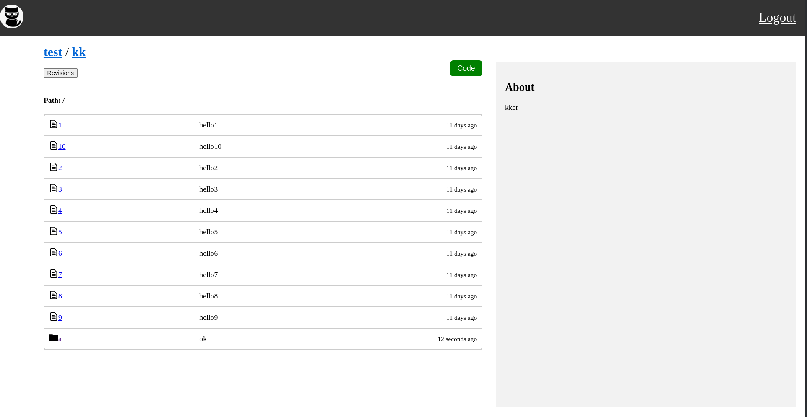

### TinyGithub

A tiny git server used for learning git principle.

### How to Use

#### golang git server
- [tinygithub](https://github.com/adlternative/tinygithub)

1. write config.json
2. go run main.go server

#### vue frontend server
- [tinygithub-frontend](https://github.com/adlternative/tinygithub-frontend)

1. npm run serve

